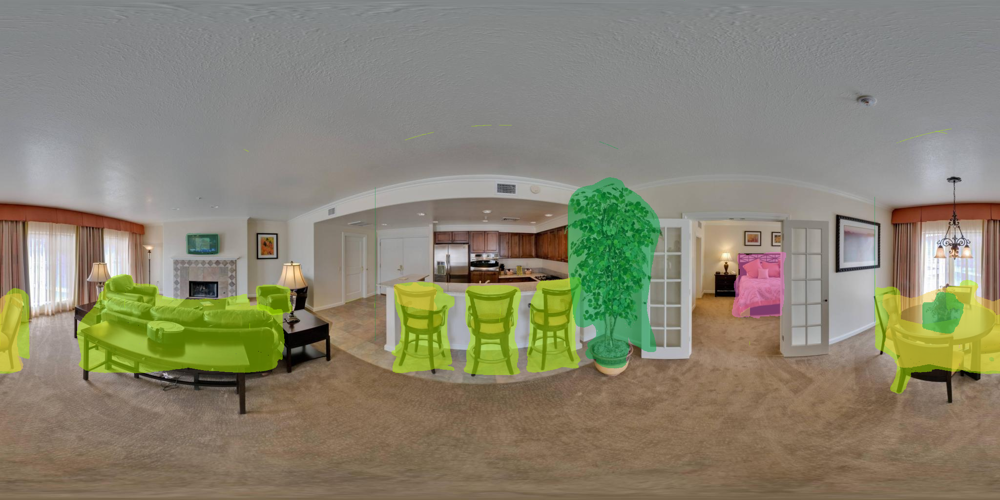

# PanoSeg 
* Panorama Semantic Segmentation



## Overview
PanoSeg is a python script about panorama semantic segmentation.<br> 
It use [YOLOv2](https://github.com/pjreddie/darknet) for object detection and [FastMask](https://github.com/voidrank/FastMask) for segmentation.

## Setup
```shell
git clone https://github.com/SunDaDenny/PanoSeg
```

Then you should clone [YOLOv2](https://github.com/pjreddie/darknet) to PanoSeg/<br>
replace YOLO source code in darknet/src with the file in PanoSeg/darknet/src.<br>
follow [YOLO: Real-Time Object Detection](https://pjreddie.com/darknet/yolo/) to compile and download pretrain model( YOLOv2 608x608 )

clone and setup [FastMask](https://github.com/voidrank/FastMask) to PanoSeg/<br>
move the script in PanoSeg/FastMask to the FastMask root director

## Run
```shell
python PanoSeg.py [input] [output]
```


